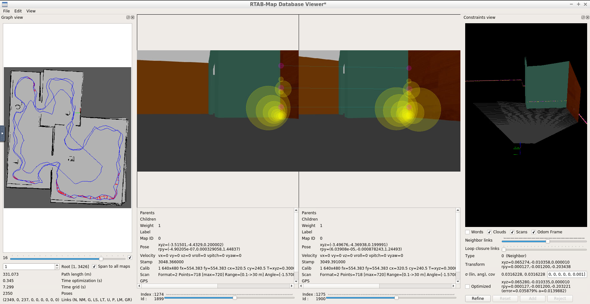

# Map My World

This is the fourth project of Udacity's Robotics Software Engineer Nanodegree. 
I used my robot and the world from [previous project](https://github.com/korhanmd/udacity-where-am-i).
Added depth camera to the robot to use in mapping process. I used RTAB-Map package to create the map of the world.

You need to clone this repo in a `catkin_ws` and change its name to the `src`. Write `catkin_make` in the root directory of catkin_ws to compile it.
Write `source devel/setup.bash` after compiled. To run the application write `roslaunch my_robot world.launch` to the terminal in the root directory of catkin_ws.
In another terminal write `rosrun teleop_twist_keyboard teleop_twist_keyboard.py` to use teleop keys to move robot.
Then, in another terminal write `roslaunch my_robot mapping.launch` to start RTAB-Map.

There are four packages in the project. They are `my_robot`, `ball_chaser`, `pgm_map_creator`, and `teleop_twist_keyboard` packages are from previous project.
Added `mapping.launch` to the `my_robot` package. This launch file includes `rtabmap` node for mapping and `rtabmapviz` node for visualization of it.
Added `teleop.launch` to control robot with teleop keys.

## Example screenshot from RTAB-Map Database Viewer

Shows generated 2D map and 3D loop closure example.
[Click](https://drive.google.com/file/d/1UAO8sXR8T7Ka682SmR8dx41yo74su8Zg/view?usp=sharing) to download database file of created map.

